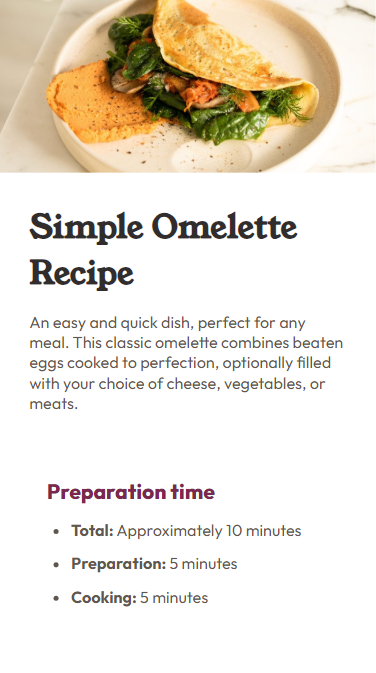
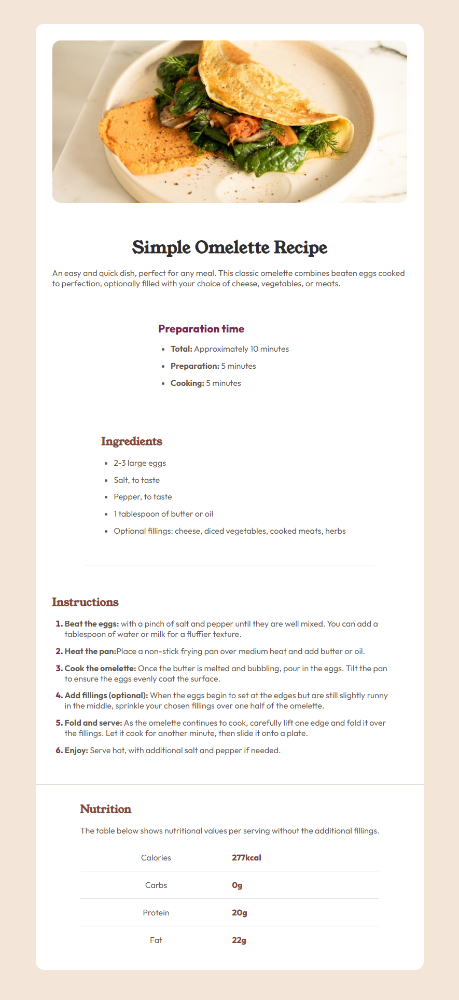

# Frontend Mentor - Recipe page solution

This is a solution to the [Recipe page challenge on Frontend Mentor](https://www.frontendmentor.io/challenges/recipe-page-KiTsR8QQKm). Frontend Mentor challenges help you improve your coding skills by building realistic projects. 

## Table of contents

- [Frontend Mentor - Recipe page solution](#frontend-mentor---recipe-page-solution)
  - [Table of contents](#table-of-contents)
  - [Overview](#overview)
    - [Screenshot](#screenshot)
  - [Mobile](#mobile)
  - [Desktop](#desktop)
    - [Links](#links)
  - [My process](#my-process)
    - [Built with](#built-with)
  - [Author](#author)

## Overview

### Screenshot

## Mobile

## Desktop

### Links

- Solution URL: [FrontEnd Mentor](https://www.frontendmentor.io/challenges/recipe-page-KiTsR8QQKm/hub?share=true)
- Live Site URL: [Vercel](https://recipe-page-eosin-six.vercel.app/)

## My process

### Built with

- Semantic HTML5 markup
- CSS custom properties
- SASS
- Flexbox
- Mobile-first workflow

## Author

- Linkedin - [Thalia Danielle](https://www.linkedin.com/in/thalia-danielle-21b968221/)
- GitHub - [Thalia Danielle](https://github.com/thaliadani)
- Frontend Mentor - [@thaliadani](https://www.frontendmentor.io/profile/thaliadani)
